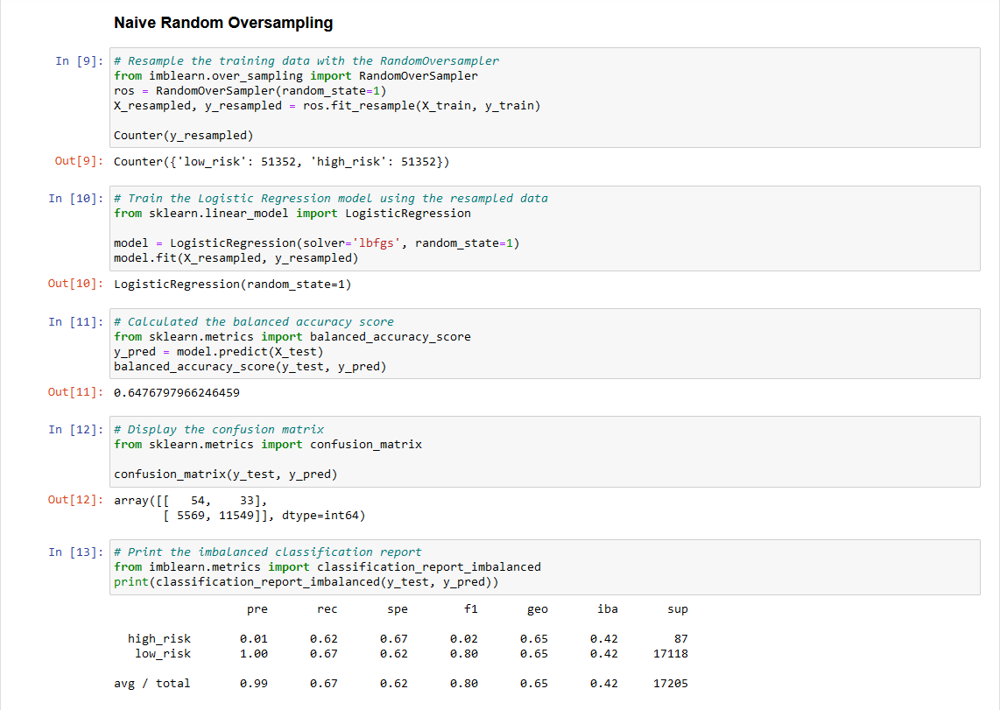
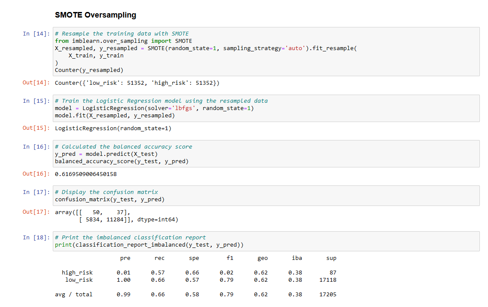
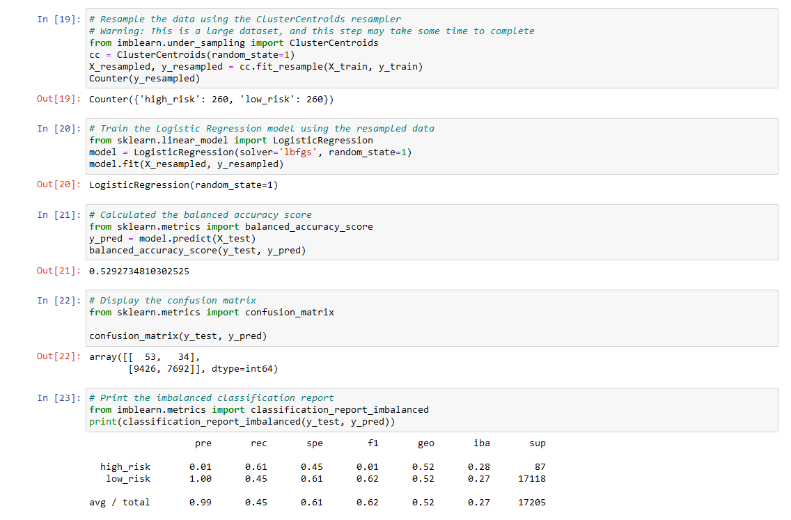
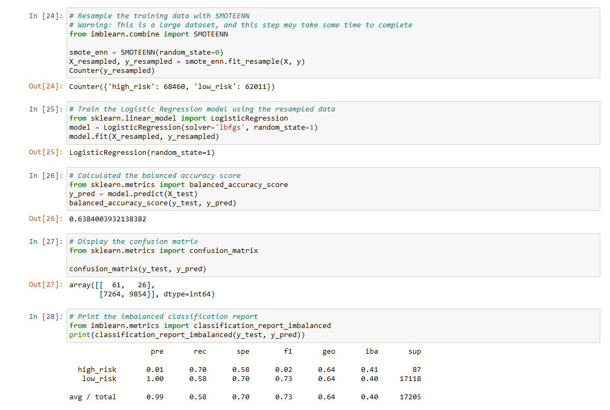
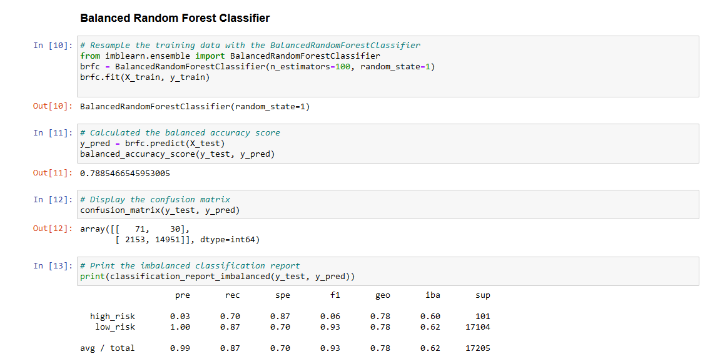
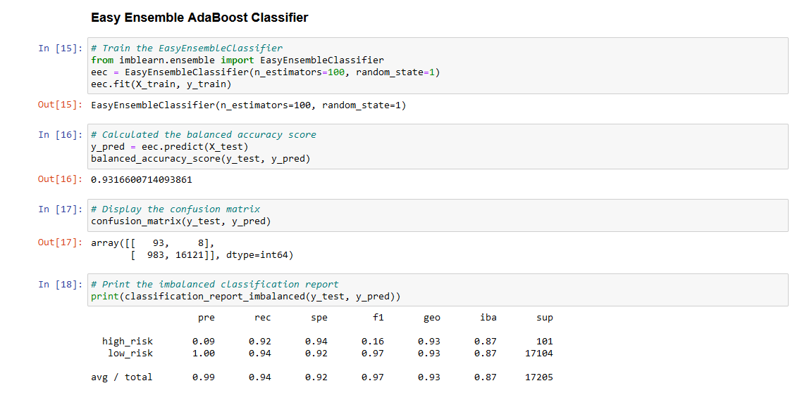

# Credit_Risk_Analysis
## Overview
We've been asked to use imbalanced-learn and scikit-learn libraries to build and evaluate models using resampling.

## Purpose
Credit risk is an inherently unbalanced classification problem, as good loans easily outnumber risky loans. Therefore, we’ll need to employ different techniques to train and evaluate models with unbalanced classes.

### The Machine Learning Models

#### Naive Random Oversampling

#### SMOTE Oversampling

#### Undersampling with ClusterCentroids

#### SMOTEENN

#### Balanced Random Forest Classifier

#### Easy Ensemble Classifier

